# AfterFall: Real-Time Attendance Checking

**Revolutionizing the way you check attendance**

## Team Members
- **Lorenzo Martins Dalmeida**: 6420015
- **Archit Changchreonkul**: 6420101
- **Kritsada Kruapat**: 6420063

**[Our Face Recognition Model](https://github.com/OwenYooYoo/webcam-antispoofing)**

## Overview

AfterFall is a modern, real-time attendance management system designed to streamline attendance tracking for educational institutions. The platform provides role-based dashboards for administrators, teachers, and students, making attendance tracking more efficient and transparent.

- **Framework**: [Next.js](https://nextjs.org/) 
- **UI Library**: [Shadcn](https://ui.shadcn.com/) and [Tailwind CSS](https://tailwindcss.com/)
- **Database**: [MongoDB Atlas](https://www.mongodb.com/cloud/atlas)
- **State Management**: React hooks and [Tanstack Table](https://tanstack.com/table)
- **Package Manager**: pnpm
- **Deployment**: Vercel

## Screenshots

### Admin
- **Dashboard**
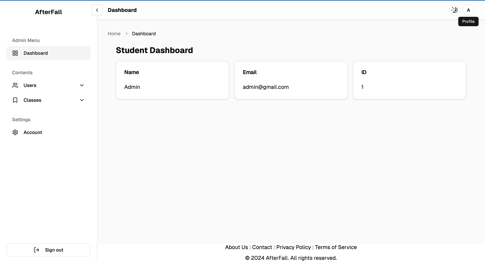
- **All Users**
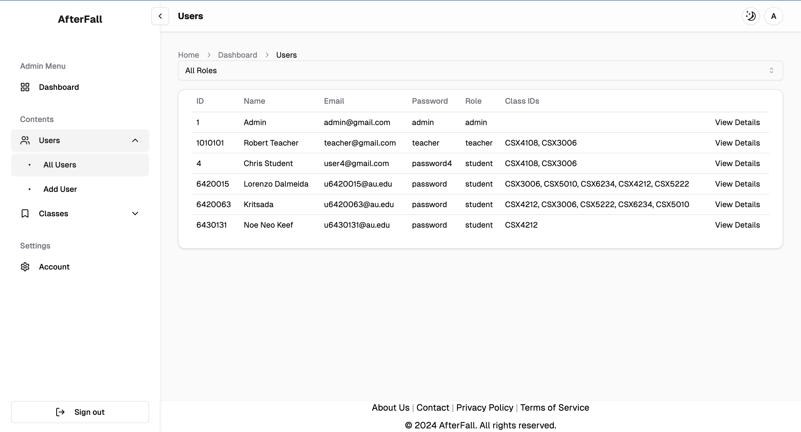
- **User Information**
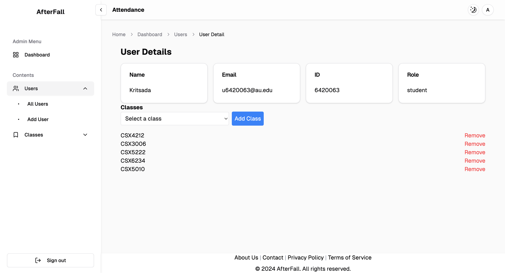
- **Add User**
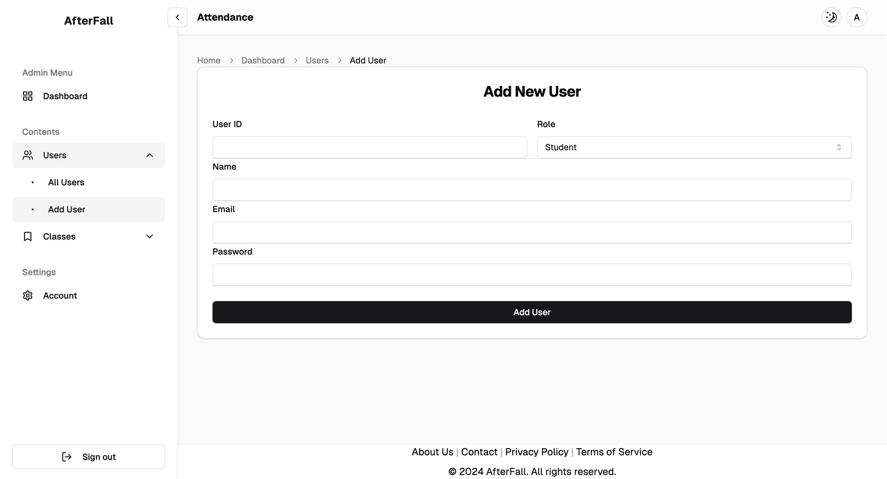
- **All Classes**
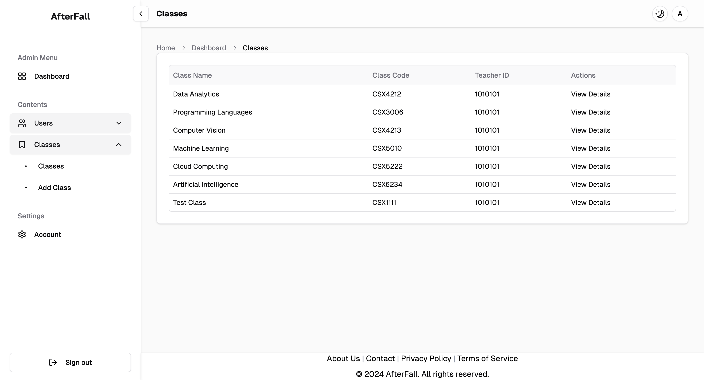
- **Class Information**
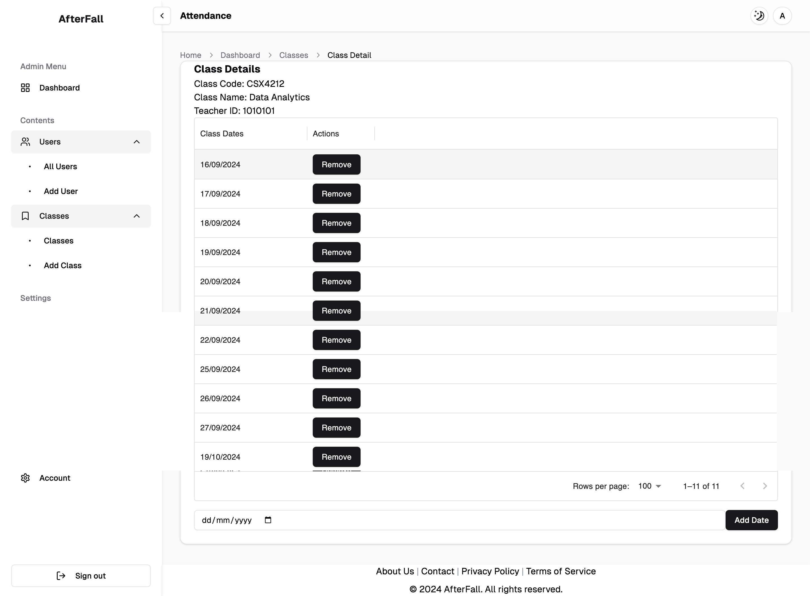
- **Add Class**
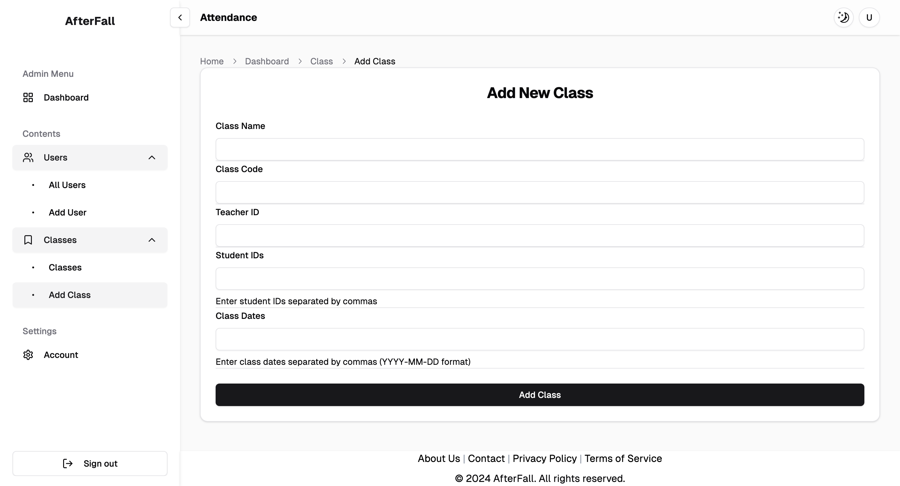
- **Account**
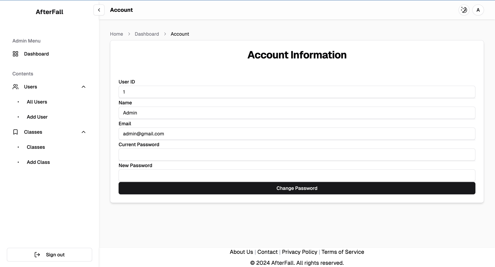

### Student and Teacher
- **Classes**
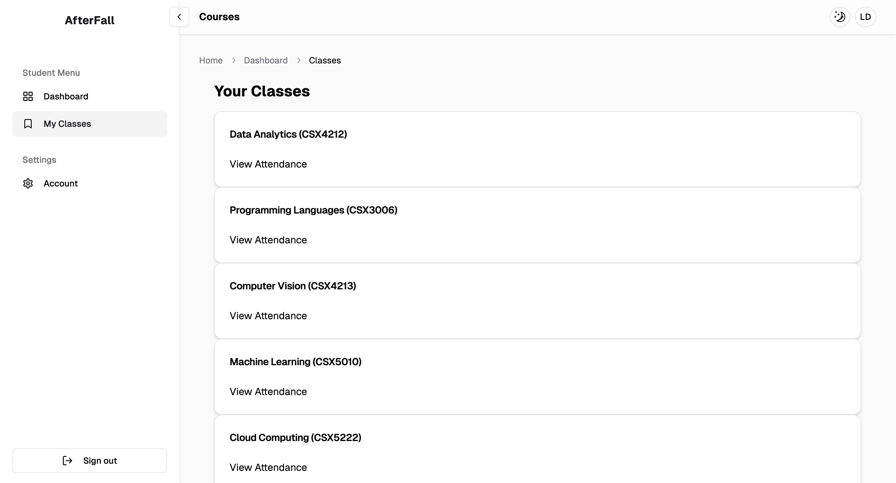
- **Teacher Attendance**
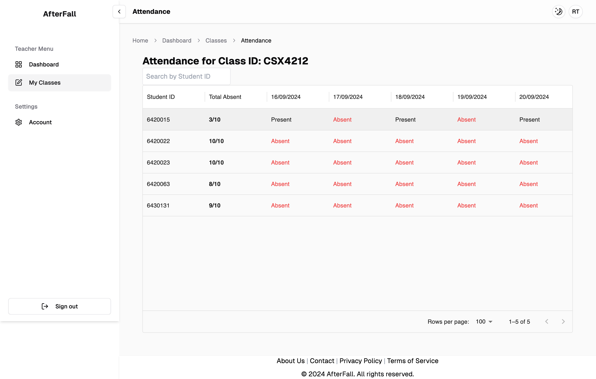
- **Student Attendance**
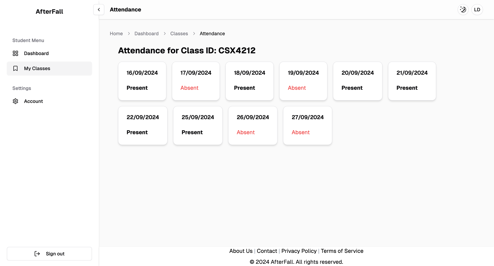

